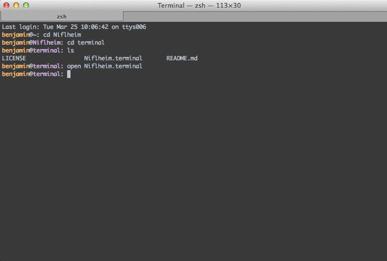

Niflheim theme for Terminal
========

A Niflheim theme for [Terminal.app](http://en.wikipedia.org/wiki/Terminal_(OS_X))

##Installation

- Download the file [Niflheim.terminal](Niflheim.terminal).
- Open terminal.app settings and import Niflheim.terminal 
- Set **Niflheim** as the default theme 

##Licence

 Niflheim by <a xmlns:cc="http://creativecommons.org/ns#" href="http://benjamin.vanryseghem.com" property="cc:attributionName" rel="cc:attributionURL">Benjamin Van Ryseghem</a> is licensed under a <a rel="license" href="http://creativecommons.org/licenses/by-sa/4.0/">Creative Commons Attribution-ShareAlike 4.0 International License</a>. Based on a work at <a xmlns:dct="http://purl.org/dc/terms/" href="https://github.com/niflheim-theme" rel="dct:source">https://github.com/niflheim-theme</a>.
